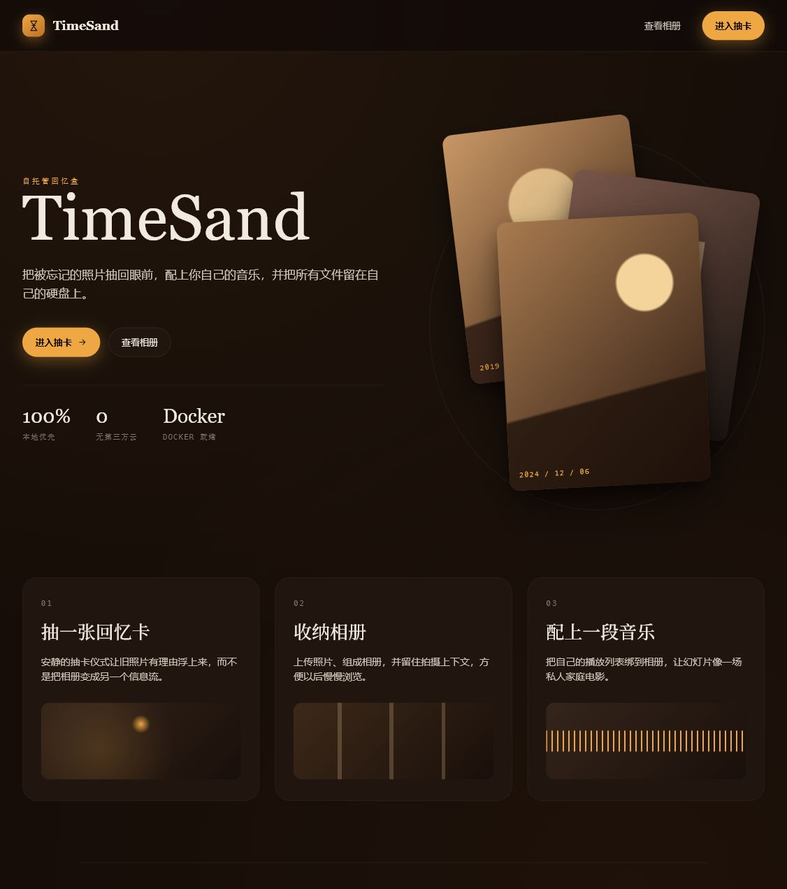
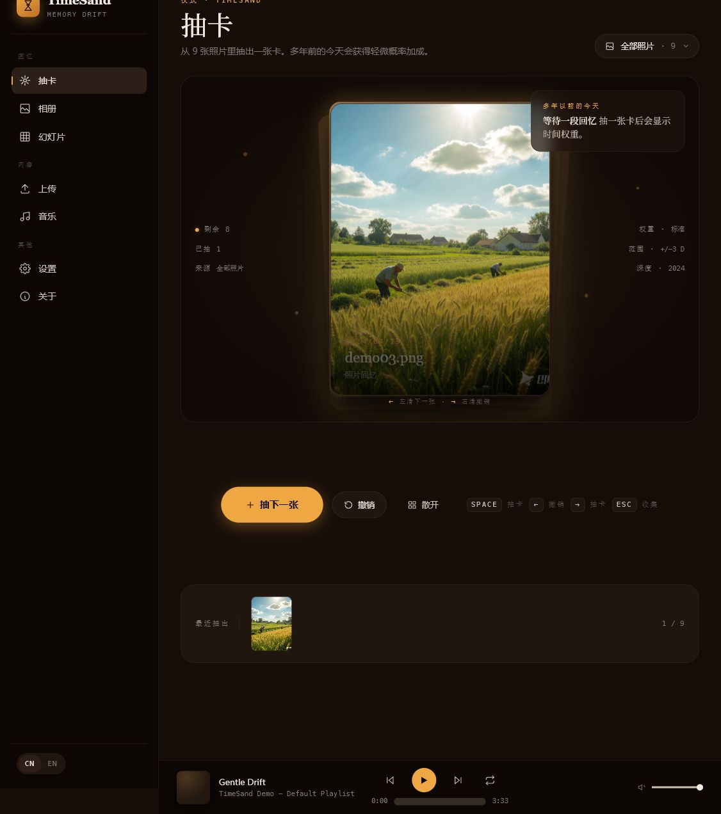
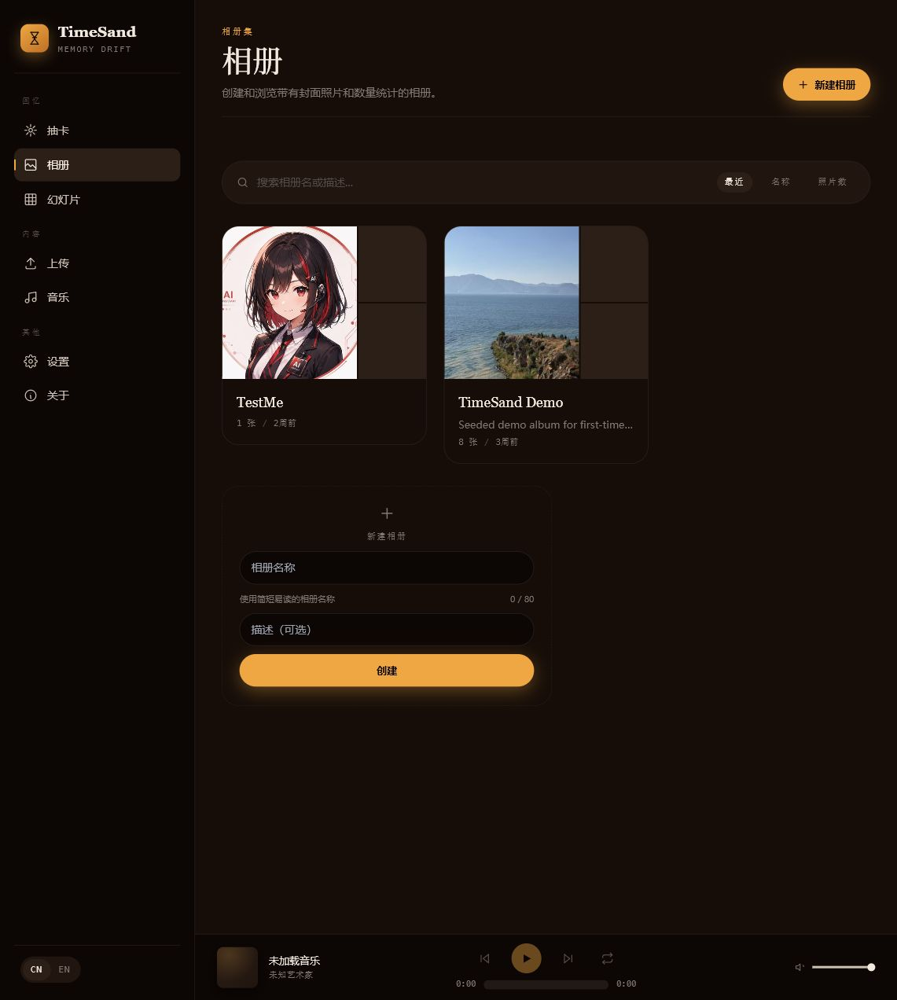
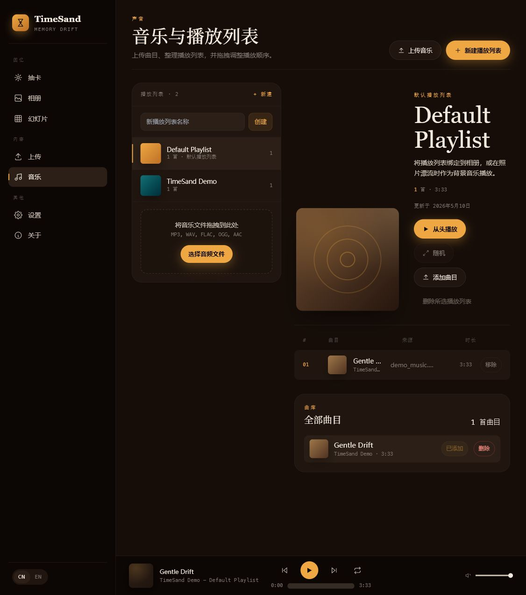
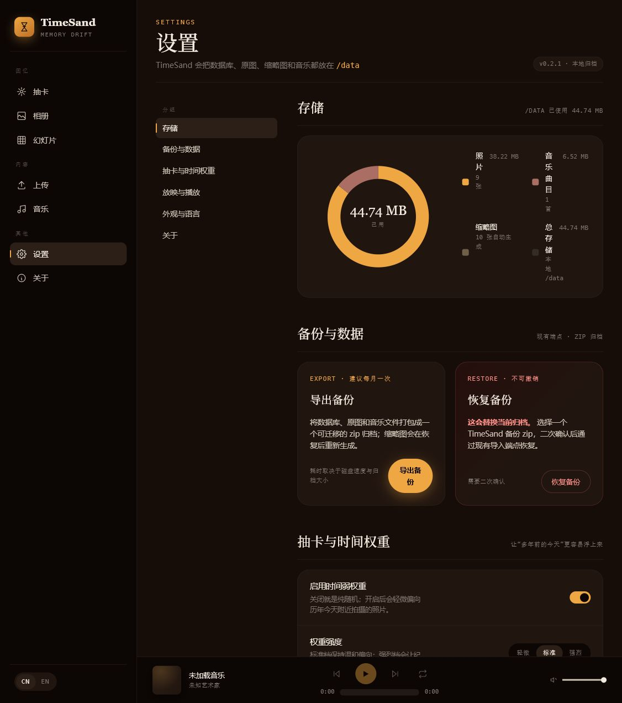

# TimeSand

TimeSand 是一个自托管的智能照片墙与音乐盒。它把本地照片归档变成更慢、更有仪式感的回忆体验：抽一张照片卡、整理相册、播放幻灯片，再配上你自己的背景音乐。

项目默认本地优先。照片、缩略图、音乐文件、播放列表、设置和 SQLite 数据库都保存在你的机器上，或保存在 Docker 挂载的数据卷里。

## 界面预览











## 核心能力

- **回忆抽卡**：从全部照片或指定相册中随机抽取照片卡片，支持撤销、洗牌、散开查看、键盘快捷键和手机滑动手势。
- **时间弱权重**：轻微提高“多年以前的今天”附近照片的抽中概率，可在设置页调整权重模式、日期范围和默认抽卡相册。
- **照片管理**：支持 JPG、PNG、HEIC、WebP 和 TIFF 上传，自动生成缩略图，并保存文件大小、尺寸、拍摄时间、位置和 MIME 类型等元数据。
- **相册与标签**：创建相册、设置描述和封面、把照片加入相册，并用标签组织照片。
- **音乐盒**：上传本地音频，创建播放列表，调整曲目顺序，并把播放列表关联到相册。
- **幻灯片模式**：以沉浸式页面播放照片，搭配过渡动画和背景音乐。
- **本地数据工具**：查看存储占用，导出 zip 备份，并从备份恢复数据库和媒体文件。
- **中英文界面**：应用外壳内置中文和英文切换。
- **演示数据**：可在首次启动时写入示例照片和音乐，方便快速体验。

## 技术栈

| 层 | 技术 |
| --- | --- |
| 前端 | Vue 3、TypeScript、Vite、Pinia、Vue Router、Vue I18n |
| UI 与动效 | TailwindCSS、Radix Vue、GSAP、Howler |
| 后端 | FastAPI、SQLModel、Alembic、Pillow、pillow-heif、Mutagen、Structlog |
| 数据库 | SQLite |
| 工具链 | Bun、uv |
| 测试 | Vitest、@vue/test-utils、pytest、Ruff、ESLint |
| 部署 | 单 Docker 容器，同时服务 API 和构建后的前端静态文件 |

## 快速开始

### 使用预构建镜像

```bash
docker compose up -d
```

默认本地地址：

- Web 应用：`http://127.0.0.1:8800`
- 健康检查：`http://127.0.0.1:8800/api/health`

`docker-compose.yml` 使用 `ghcr.io/itmwuma/timesand:latest`，把宿主机端口 `8800` 映射到容器端口 `8080`，并把本地 `./data` 挂载到容器内的 `/data`。

### 本地构建镜像

```bash
docker compose -f docker-compose.build.yml up -d --build
```

当你希望用当前代码构建 Vue 前端和 FastAPI 运行镜像时，使用这个方式。

### 运行数据目录

所有运行时文件都位于 `DATA_DIR`。Docker 环境中该目录为 `/data`，来自本地挂载的 `./data`。

```text
data/
├── timesand.db
├── photos/
│   ├── originals/
│   └── thumbnails/
└── music/
    └── files/
```

建议定期从设置页导出备份，或直接备份整个 `data/` 目录。

## 本地开发

### 一键启动

Windows PowerShell：

```powershell
.\quick-start.ps1
```

Linux/macOS：

```bash
./quick-start.sh
```

默认开发地址：

- 前端开发服务器：`http://127.0.0.1:5173`
- 后端 API：`http://127.0.0.1:8000`
- 后端健康检查：`http://127.0.0.1:8000/api/health`

### 前端

```bash
cd frontend
bun install
bun run dev
```

常用命令：

```bash
bun run build
bun run lint
bun run lint:fix
bun run type-check
bun run test
```

### 后端

```bash
cd backend
uv venv -p 3.12
uv sync
uv run uvicorn app.main:app --reload --host 0.0.0.0 --port 8000
```

常用命令：

```bash
uv run ruff check .
uv run pytest
```

## 配置项

后端通过环境变量配置。

| 变量 | 默认值 | 说明 |
| --- | --- | --- |
| `DATA_DIR` | `../data` | 数据库和媒体文件根目录，Docker 中设置为 `/data`。 |
| `CORS_ORIGINS` | `http://localhost:5173,http://127.0.0.1:5173` | 开发环境允许的前端来源。 |
| `LOG_LEVEL` | `INFO` | 后端日志级别。 |
| `LOG_FORMAT` | `json` | 后端日志格式。 |
| `ENABLE_DEMO_SEED` | `true` | 是否在启动时写入演示媒体。 |
| `TIMESAND_ADMIN_USERNAME` | `admin` | 用户表为空时自动创建的初始管理员用户名。 |
| `TIMESAND_ADMIN_PASSWORD` | 未设置 | 初始管理员密码，首次启动前应设置为至少 8 个字符；未设置时系统保持未初始化，`/api/auth/login` 返回 503。 |

生产环境前端默认请求同源 `/api`，由 FastAPI 同时托管构建后的静态前端和 API。

## 项目结构

```text
timesand/
├── frontend/                 # Vue 3 单页应用
│   ├── src/
│   │   ├── assets/           # 全局样式和设计 token
│   │   ├── components/       # UI、上传器、播放器、抽卡组件
│   │   ├── composables/      # 抽卡、音乐、幻灯片、动效、提示逻辑
│   │   ├── i18n/             # 中文和英文语言文件
│   │   ├── layouts/          # 应用外壳布局
│   │   ├── pages/            # 路由页面
│   │   ├── router/           # Vue Router 配置
│   │   ├── services/         # Axios API 客户端
│   │   ├── stores/           # Pinia 状态
│   │   └── types/            # TypeScript 类型
│   └── package.json
├── backend/                  # FastAPI 应用
│   ├── app/
│   │   ├── api/              # REST 路由
│   │   ├── core/             # 配置、数据库、日志、异常处理
│   │   ├── demo_data/        # 演示媒体
│   │   ├── models/           # SQLModel 数据模型
│   │   ├── services/         # 业务逻辑
│   │   └── main.py           # 应用入口
│   ├── alembic/              # 数据库迁移
│   ├── tests/                # 后端测试
│   └── pyproject.toml
├── data/                     # 本地运行数据，Docker 部署时作为卷挂载
├── docs/                     # 规划文档和 README 截图
├── Dockerfile                # 多阶段单容器镜像
├── docker-compose.yml        # 使用预构建镜像运行
└── docker-compose.build.yml  # 本地构建镜像运行
```

## API 概览

主要 API 分组：

- `GET /api/health`：健康检查
- `/api/photos`：照片上传、列表、详情、删除、原图和缩略图访问
- `/api/albums`：相册 CRUD、相册照片、相册播放列表关联
- `/api/tags` 与 `/api/photos/{photo_id}/tags`：标签管理
- `/api/draw`：抽卡和重置抽卡池
- `/api/music`：音乐上传、列表、详情、删除、文件访问
- `/api/playlists`：播放列表 CRUD、添加、移除和排序曲目
- `/api/slideshow`：幻灯片照片列表
- `/api/settings/storage`：存储统计
- `/api/backup/export` 与 `/api/backup/import`：备份导出和恢复
- `/api/demo`：演示数据清理

## 质量检查

前端：

```bash
cd frontend
bun run lint
bun run type-check
bun run test
```

后端：

```bash
cd backend
uv run ruff check .
uv run pytest
```

如果改动了 `frontend/package.json`、`frontend/bun.lock`、`backend/pyproject.toml` 或 `backend/uv.toml`，建议重新安装依赖后再次验证。

## 国内镜像

仓库已配置常用国内镜像以加速安装：

- 前端 `.npmrc`：`https://registry.npmmirror.com`
- 后端 `uv.toml`：`https://mirrors.tuna.tsinghua.edu.cn/pypi/web/simple`
- Dockerfile 默认使用 `docker.m.daocloud.io/` 作为基础镜像前缀，可通过 `IMAGE_REGISTRY` build arg 覆盖。

## 当前限制

- MVP 阶段没有内置用户认证和权限系统，建议只部署在可信局域网，或放在带认证的反向代理之后。
- 默认使用 SQLite 和本地文件系统，适合个人与家庭规模使用。
- 抽卡会话状态主要保存在前端，前端通过 `exclude_ids` 让后端避免在同一会话里重复抽取。
